<!-- HERO BANNER SECTION -->
<div align="center">
  
  
  <br><br>

  <!-- Quick Action Badges -->
  <p align="center">
    <a href="https://andreafinazzi.com"></a>
    &nbsp;&nbsp;
    <a href="mailto:andrea.finazzi.info@gmail.com"></a>
  </p>
</div>

<!-- Dynamic Divider -->


<br>

<!-- OPERATIONAL PHILOSOPHY -->
### 🧠 Operational Philosophy

> "High-performance logic deserves high-fidelity presentation. Engineering and aesthetics are part of the same standard."

I engineer robust software environments at the convergence of **quantitative systems, local-first AI pipelines, and premium product design**. I believe that internal developer platforms, quantitative tools, and CLI environments should not only perform exceptionally but also provide intuitive, beautiful, and satisfying user experiences.

<br>

<!-- DISTINCTIVE DETAIL: THE DUAL-HELIX DESIGN CALLOUT -->
<table width="100%" border="0" cellspacing="0" cellpadding="0">
  <tr>
    <td style="border-left: 4px solid #09F1B8; padding-left: 15px; padding-top: 10px; padding-bottom: 10px; background-color: #0c1020; border-radius: 4px;">
      <p align="left">
        <strong>🎨 The Dual-Helix Standard: Performance &amp; Aesthetics</strong><br>
        I reject the paradigm that command-line utilities, automation scripts, or internal dashboards must be visually neglected to be robust. <strong>Developer Experience (DX) is a product.</strong> A beautifully drawn terminal HUD, a clean dataflow scheme, or an aligned coordinate layout reduces cognitive load, minimizes operator error during high-stakes trading cycles, and respects the builder's craft.
      </p>
    </td>
  </tr>
</table>

<br>

<!-- Dynamic Divider -->


<br>

<!-- CORE CAPABILITIES GRID -->
### 🛠️ Core Capabilities & Systems

<table width="100%">
  <tr>
    <td width="33%" valign="top">
      <h4>📈 Quantitative Systems</h4>
      <ul>
        <li>Proprietary time-series cycle analysis indicators (Pine Script / TradingView)</li>
        <li>Custom market cycle swing detectors and structural regime backtesters</li>
        <li>Focus on low-latency market analysis and data-driven risk management</li>
      </ul>
    </td>
    <td width="33%" valign="top">
      <h4>🧠 Knowledge Engineering</h4>
      <ul>
        <li>Local vector search pipelines (SQLite, pgvector) for private research indexing</li>
        <li>Token-efficient context routing frameworks for local LLM orchestration</li>
        <li>Secure-by-default, isolated local knowledge mining infrastructures</li>
      </ul>
    </td>
    <td width="33%" valign="top">
      <h4>🐳 Infrastructure & DX</h4>
      <ul>
        <li>Docker-first developer environments for absolute workspace isolation</li>
        <li>Low-overhead terminal HUD status bars and automation shell wrappers</li>
        <li>Performance-focused CLI utility engineering to accelerate operations</li>
      </ul>
    </td>
  </tr>
</table>

<br>

<!-- Dynamic Divider -->


<br>

<!-- FEATURED PUBLIC PROJECT SPOTLIGHT -->
### 🔌 Featured Public Project

<div align="center">

```
╭──────────────────────────────────────────────────────────────────────────╮
│  ⚡ claude-statusline-pro                                                │
├──────────────────────────────────────────────────────────────────────────┤
│  A terminal HUD status bar for Claude Code that displays real-time       │
│  token usage, session costs, Git branch status, and tool freshness      │
│  directly inside your shell environment.                                 │
├──────────────────────────────────────────────────────────────────────────┤
│  🟢 Status: Active   |   ⚖️ License: MIT   |   📁 Language: Bash 4+       │
╰──────────────────────────────────────────────────────────────────────────╯
```

👉 **[Explore claude-statusline-pro on GitHub](https://github.com/andreafinazziinfo/claude-statusline-pro)**

</div>

<br>

<!-- Dynamic Divider -->


<br>

<!-- OPERATING MODEL -->
### ⚙️ Operating Model

I structure my systems around an absolute segregation between trading execution and open-source infrastructure. My workflows are local-first and private-by-default, keeping intellectual property highly protected while sharing developer experience (DX) tooling:

```
┌─────────────────────────────────┐       ┌─────────────────────────────────┐
│     PROPRIETARY SYSTEMS (🔒)     │       │     PUBLIC UTILITIES (🔌)       │
├─────────────────────────────────┤       ├─────────────────────────────────┤
│ · Cycle Analysis Indicators     │       │ · Dev-Tools (Claude Statusline) │
│ · Backtesting Engines & Regimes │ ───>  │ · CLI Wrapper Filters           │
│ · Local Vector Knowledge Bases  │       │ · Shell Automation Scripts      │
└─────────────────────────────────┘       └─────────────────────────────────┘
```

<br>

<!-- Dynamic Divider -->


<br>

<!-- TECH STACK SECTION -->
### 🛠️ Tech Stack & Capabilities

<div align="center">
  <table width="100%" border="0" cellspacing="0" cellpadding="5">
    <tr>
      <td width="33%" align="center" valign="top">
        <strong>Core Programming</strong><br><br>
        
        
        
        <br>
        
        
      </td>
      <td width="33%" align="center" valign="top">
        <strong>Data &amp; Storage</strong><br><br>
        
        
        <br>
        
        
      </td>
      <td width="33%" align="center" valign="top">
        <strong>Infra &amp; Ecosystem</strong><br><br>
        
        
        <br>
        
        
      </td>
    </tr>
  </table>
</div>

<br>

<!-- Dynamic Divider -->


<br>

<!-- TELEMETRY / STATS -->
### 📈 GitHub Telemetry

<div align="center">
  <table border="0" cellspacing="10" cellpadding="0">
    <tr>
      <td align="center" valign="middle">
        
      </td>
      <td align="center" valign="middle">
        
      </td>
    </tr>
  </table>
</div>

<br>

<!-- Dynamic Divider -->


<br>

<!-- SECURE SECRETS / CONTACT -->
### ✉️ Contacts & Gateways

*   **Official Gateway:** [andreafinazzi.com](https://andreafinazzi.com)
*   **Secure Email Gateway:** [andrea.finazzi.info@gmail.com](mailto:andrea.finazzi.info@gmail.com)
